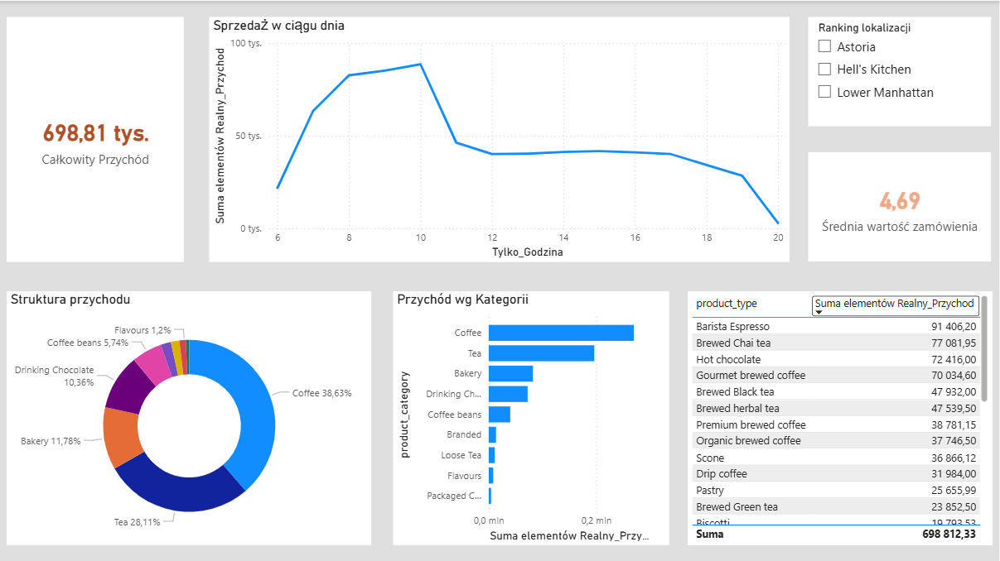

# Coffee-Shop-Sales-Analysis
## Cel projektu
Głównym celem było przeanalizowanie danych sprzedaży sieci kawiarni. Miałam do dyspozycji ponad 149 000 rekordów. Chciałam przygotować te dane do analizy i wyciągnąć wnioski na temat rentowności produktów i zachowań klientów.
## Narzędzia i Dane
* **Źródło danych:** [Coffee Shop Sales Dataset (Kaggle)](https://www.kaggle.com/datasets/ahmedmohamedibrahim1/coffee-shop-sales-dataset?resource=download)
* **Technologia:** Microsoft SQL Server (T-SQL)

---
## Proces Czyszczenia Danych
Dane wymagały czyszczenia, ponieważ były błędy w typach danych. Na przykład, ceny były zapisane z przecinkami jako tekst.
**Kluczowe operacje:**
* Konwersja cen na format liczbowy: `TRY_CAST(REPLACE(unit_price, ',', '.') AS FLOAT)`
* Naprawa formatu daty (zamiana kropek na myślniki) dla poprawnego sortowania dni tygodnia.
* Obsługa wartości NULL w kolumnach finansowych poprzez ręczne przeliczanie przychodu: `unit_price * transaction_qty`.

---

## Kluczowe Analizy i Zapytania SQL

### 1. Segmentacja produktów (Analiza Biznesowa)
Zastosowałam logikę warunkową, aby podzielić asortyment na segmenty cenowe:
```sql
SELECT 
    CASE 
        WHEN unit_price < 3.00 THEN 'Tania Kawa'
        WHEN unit_price BETWEEN 3.00 AND 4.00 THEN 'Standard'
        ELSE 'Produkt Premium'
    END AS Segment_Cenowy,
    SUM(unit_price * transaction_qty) AS Razem_Przychód
FROM Transactions_Clean
WHERE product_category = 'Coffee'
GROUP BY 
    CASE 
        WHEN unit_price < 3.00 THEN 'Tania Kawa'
        WHEN unit_price BETWEEN 3.00 AND 4.00 THEN 'Standard'
        ELSE 'Produkt Premium'
    END;
```

### 2. Ranking produktów Premium (>4.00)
Analiza wykazała, że produkty takie jak Herbal Tea generują znaczący zysk w tym segmencie.

```sql
SELECT 
    product_type, 
    SUM(unit_price * transaction_qty) AS Zysk_Premium
FROM Transactions_Clean 
WHERE unit_price > 4 
GROUP BY product_type 
ORDER BY Zysk_Premium DESC;
```

## Główne Wnioski
Liderzy Sprzedaży: Największy ruch i utarg generowany jest w poniedziałki i środy.

Efektywność segmentów: Mimo mniejszej liczby transakcji, segment Premium (w tym Herbal Tea) wykazuje najwyższą marżę.

Średni koszyk: Wynosi ok. 4,68, co stanowi bazę do planowania przyszłych kampanii typu up-selling.

## Wizualizacja w Power BI
Stworzyłam interaktywny dashboard, który łączy się z bazą SQL i pozwala na bieżąco monitorować kondycję biznesu.



### Kluczowe funkcjonalności raportu:
* **Analiza czasowa:** Wykres liniowy pozwolił zidentyfikować "godziny szczytu" (8:00–10:00), co ułatwia planowanie obsady personelu.
* **Struktura asortymentu:** Wykres pierścieniowy pokazuje udział poszczególnych kategorii – kawa stanowi główny filar przychodów (ok. 39%).
* **Monitorowanie KPI:** Dzięki kartom wyników na bieżąco widzimy całkowity utarg oraz średnią wartość zamówienia (4.69).
* **Interaktywność:** Dodanie filtrów lokalizacji pozwala na błyskawiczne porównanie wyników między różnymi punktami sprzedaży.
